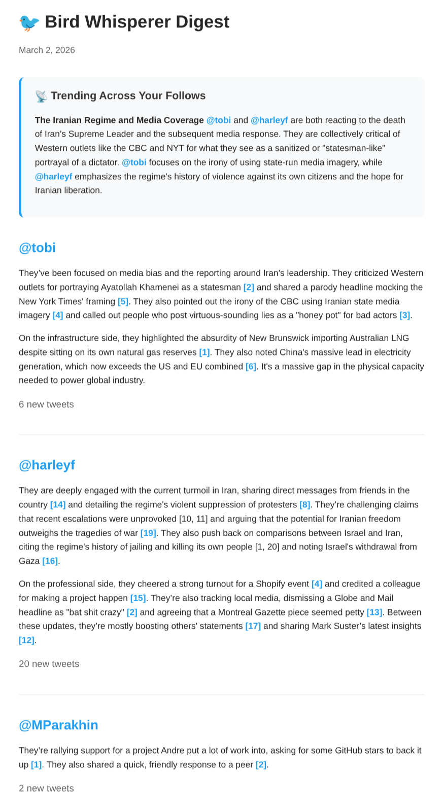

# Bird Whisperer

Daily X digest delivered to your inbox. Follow specific accounts, summarize what changed, and get one email per day.

[](https://deploy.workers.cloudflare.com/?url=https://github.com/hirefrank/bird-whisperer)



## Required API credentials

Bird Whisperer **requires** an X (Twitter) API bearer token. Without it, the Worker cannot fetch tweets and your digest will be empty or skipped.

Before deploy, make sure you have:

- `X_BEARER_TOKEN` from X API v2 (**required**)
- `GEMINI_API_KEY` for summaries (**required**)
- One email provider (`RESEND_API_KEY` or Cloudflare Email Service)

## Prerequisites

- Cloudflare account with Workers enabled
- X API v2 access and a valid bearer token
- Gemini API key
- Node.js 20+ and pnpm
- Wrangler CLI authenticated (`wrangler login`)

## One-Click Deploy

1. Click the **Deploy to Cloudflare Workers** button above.
2. After deploy, set required secrets (**do not skip `X_BEARER_TOKEN`**):

```bash
wrangler secret put X_BEARER_TOKEN
wrangler secret put GEMINI_API_KEY
```

If you're setting these up incrementally, set `X_BEARER_TOKEN` first.

Optional quick token check (recommended):

```bash
curl -sS \
  -H "Authorization: Bearer <X_BEARER_TOKEN>" \
  "https://api.x.com/2/users/by/username/x"
```

If the token is valid, you should get a JSON response with `data.id`.

3. Choose an email provider:

```bash
# Option A: Resend (default if RESEND_API_KEY exists)
wrangler secret put RESEND_API_KEY

# Option B: Cloudflare Email Service
# - Keep [[send_email]] name = "EMAIL" in wrangler.toml
# - Set a verified sender via EMAIL_FROM if needed
# - Optional: force provider via Variables: EMAIL_PROVIDER=cloudflare
```

4. Configure who to follow (pick one):
   - Edit `config.yaml` in your fork, or
   - Set a `CONFIG_YAML` secret to fully override bundled config

   Existing deployments can preserve current settings with:

```bash
pnpm run config:push
```

5. (Optional) run a manual digest:

```bash
wrangler secret put ENABLE_MANUAL_TRIGGER
# value: true

WORKER_URL=https://your-worker.workers.dev pnpm run trigger
```

`/trigger` is publicly reachable while `ENABLE_MANUAL_TRIGGER=true`, so disable it after testing.

## Manual CLI setup (no one-click)

If you prefer fully manual setup, use this path:

```bash
pnpm install
wrangler login
cp wrangler.example.toml wrangler.local.toml
pnpm run kv:create
```

Then copy the KV namespace ID from `pnpm run kv:create` output into `wrangler.local.toml` (`[[kv_namespaces]].id`), set your secrets against that config, and deploy:

```bash
wrangler secret put X_BEARER_TOKEN --config wrangler.local.toml
wrangler secret put GEMINI_API_KEY --config wrangler.local.toml
# plus either RESEND_API_KEY or Cloudflare Email Service binding

pnpm run deploy:local
```

## Architecture

```
Cloudflare Worker (daily cron)
  -> load config (CONFIG_YAML secret or bundled config.yaml)
  -> fetch tweets from X API v2 (bearer token)
  -> dedupe with KV (last seen IDs + sent flag)
  -> summarize with Gemini
  -> add optional aggregate insights block across follows
  -> render HTML + inline footnote links
  -> send digest via Resend or Cloudflare Email Service
```

### Digest sections

- Per-follow summaries with inline `[N]` links to source tweets.
- Optional **Trending Across Your Follows** aggregate block at the top of the digest.

The aggregate block is generated only when at least 2 followed accounts have new tweets and the model finds meaningful shared topics. If no shared topics are found, the block is omitted.

## Configuration

### Config source order

1. `CONFIG_YAML` secret (if set)
2. Bundled `config.yaml` (tracked template file)

`config.yaml` is intentionally safe by default (`users: []`). No emails are sent until you add users.

### Example config

```yaml
users:
  - email:
      - person@example.com
      - partner@example.com
    context: "I work in product and care about AI infrastructure and startup trends."
    follows:
      - username: tobi
      - username: harleyf

llm:
  provider: google
  model: gemini-3-flash-preview

prompt: |
  You are writing a section of a personalized newsletter digest...
```

For the full prompt template, see `config.example.yaml`.

### Email providers

- `EMAIL_PROVIDER=resend`: force Resend (requires `RESEND_API_KEY`)
- `EMAIL_PROVIDER=cloudflare`: force Cloudflare Email Service (requires `[[send_email]] name = "EMAIL"`)
- If `EMAIL_PROVIDER` is unset, Bird Whisperer auto-selects:
  - Resend when `RESEND_API_KEY` exists
  - Cloudflare Email Service when `EMAIL` binding exists

Sender defaults:

- Default from address: `Bird Whisperer <noreply@notifications.hirefrank.com>`
- Optional overrides: `EMAIL_FROM`, `EMAIL_REPLY_TO`
- `EMAIL_FROM` should be a sender/domain verified with your selected provider, or delivery may fail.

## Local Overrides (Production Safety)

`wrangler.toml` is committed with template-safe values for one-click deploy.

For your personal deployment settings, use `wrangler.local.toml` (gitignored):

```bash
cp wrangler.example.toml wrangler.local.toml
```

Then run local override commands:

```bash
pnpm run dev:local
pnpm run deploy:local
```

To keep a local config file outside git, use `config.local.yaml` (gitignored).

`pnpm run config:push` reads `config.local.yaml` (or `config.yaml`) and updates the `CONFIG_YAML` secret.

## Commands

```bash
# Development
pnpm run dev
pnpm run dev:local

# Type checking
pnpm run typecheck

# Deploy
pnpm run deploy
pnpm run deploy:local

# Push local YAML config to CONFIG_YAML secret
pnpm run config:push

# KV helpers
pnpm run kv:create
pnpm run kv:reset

# Manual trigger controls
pnpm run trigger:enable
pnpm run trigger:disable
WORKER_URL=https://your-worker.workers.dev pnpm run trigger
```

`kv:reset` uses `wrangler.local.toml` automatically when it exists.

## First-run smoke test

```bash
pnpm run trigger:enable
WORKER_URL=https://your-worker.workers.dev pnpm run trigger
wrangler tail
pnpm run trigger:disable
```

The default schedule in `wrangler.toml` is `0 13 * * *` (13:00 UTC). Adjust the cron if you want a different local send time.

## Scaling notes

- Scheduled Workers have a 15-minute execution limit.
- Per follow: ~1 X tweets call + 1 Gemini call (user ID cached in KV after first lookup).
- Per user: up to 1 additional Gemini call for aggregate cross-follow insights (only when 2+ follows have new tweets).
- Per recipient: 1 outbound email via configured provider.
- Practical starting limit: ~5 users with ~5 follows each.

## Troubleshooting

### Worker logs

```bash
wrangler tail
```

### Trigger fails with 403/404

- Ensure `ENABLE_MANUAL_TRIGGER=true` secret is set.
- Ensure `WORKER_URL` points to your deployed worker.

### No tweets returned

- Verify `X_BEARER_TOKEN` has access to X API v2 user tweet endpoints.
- Check logs for `[getUserTweets]` and `[getUserIdByUsername]` errors.

### Config validation errors

- Validate YAML structure against `config.example.yaml`.
- If using `CONFIG_YAML`, ensure it parses to an object with `users` and `llm`.

## Files

```
bird-whisperer/
|- wrangler.toml           # committed template config for one-click deploy
|- wrangler.example.toml   # copy to wrangler.local.toml for personal overrides
|- config.yaml             # committed safe template (users: [])
|- config.example.yaml     # full example + default prompt template
|- src/
|  |- index.ts             # Worker entry point and digest pipeline
|  |- config.ts            # YAML loading and Zod validation
|  |- yaml.d.ts            # YAML import declarations
|- scripts/
|  |- kv-reset.sh          # reset KV keys in remote namespace
|  |- push-config-secret.sh # push YAML config to CONFIG_YAML secret
|  |- trigger.mjs          # manual /trigger helper (uses WORKER_URL)
|- README.md
```

## License

MIT
